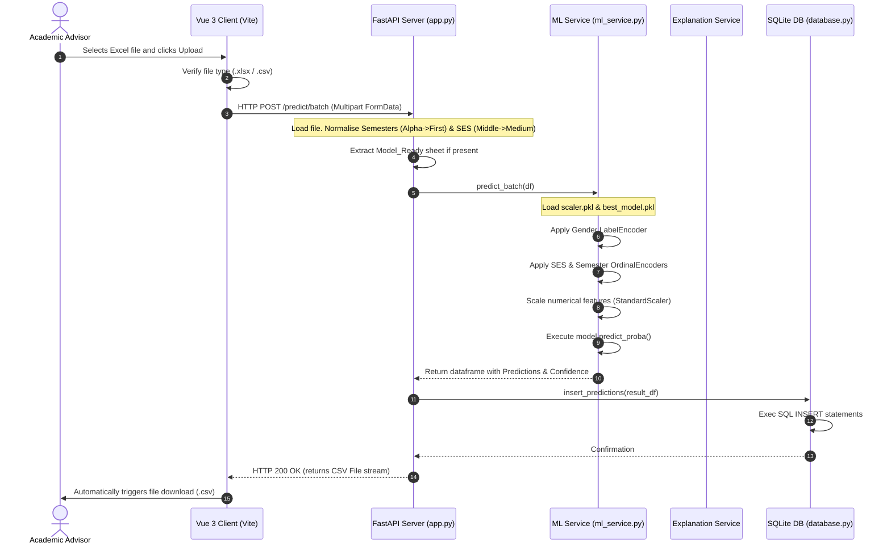
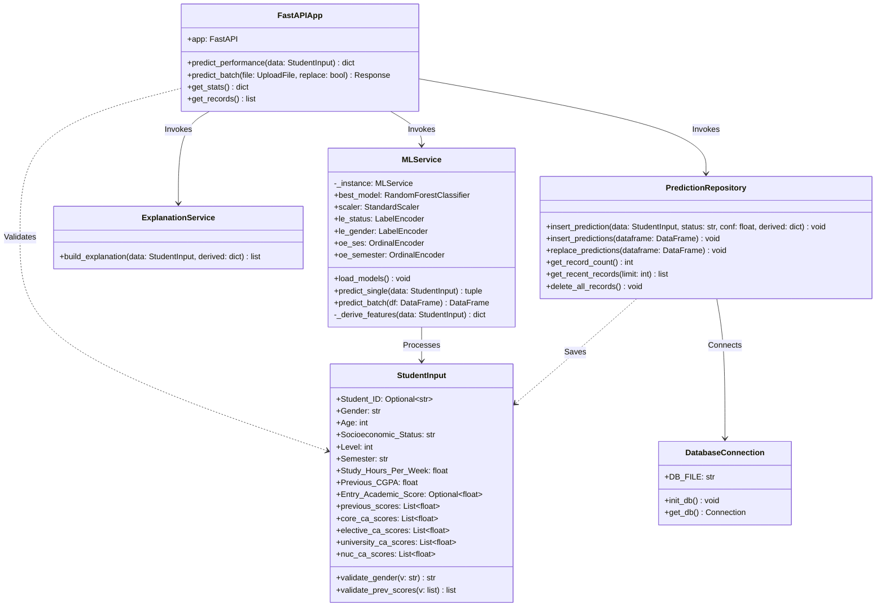

# CHAPTER THREE: SYSTEM ANALYSIS AND DESIGN

## 3.1 Preamble
This chapter details the system analysis and design phase of the EduPredict AI academic performance prediction platform. Unlike survey-based research studies, this chapter focuses on the engineering, structural, and algorithmic design of the already-implemented decision support system. It establishes the deficiencies of traditional retrospectively managed academic tracking methods, details the functional and non-functional specifications of the new system, and models the system's runtime architecture, database layouts, and object behaviors using UML standards. Furthermore, the internal mechanisms of the 17-feature machine learning pipeline, standard scaling processes, and rules-based heuristic explainability logic are detailed to document how student records are preprocessed, classified, and translated into actionable pedagogical interventions.

---

## 3.2 Analysis of the Existing System
To understand the necessity of a predictive early-warning platform, it is essential to analyze the existing administrative workflows used to monitor student academic performance in typical tertiary institutions.

### 3.2.1 Description of the Existing System
The existing academic monitoring process is primarily manual or semi-automated, relying on decentralized spreadsheets (e.g., Microsoft Excel) maintained by individual lecturers, department secretaries, and academic advisors. Student academic records—specifically Continuous Assessment (CA) scores, class attendance registers, and final exam marks—are collected independently across different courses. The evaluation of these records is retrospective; administrators and advisors compute student Cumulative Grade Point Averages (CGPA) only at the end of each semester after final exam scripts have been graded, compiled, and approved by the university senate.

### 3.2.2 Workflow of the Existing System
```
+---------------+     +-----------------------+     +----------------------+
|  Data Entry   |     |  Decentralized Files  |     |  End-of-Semester     |
| (Lecturer     | --> | (Spreadsheets stored  | --> |  Senate Approval of  |
|  records CA)  |     |  on local computers)  |     |  Final GPA Logs      |
+---------------+     +-----------------------+     +-----------+----------+
                                                                |
                                                                v
+---------------+     +-----------------------+     +-----------+----------+
| Post-Facto    |     | Delayed Student       |     |  Retrospective Review|
| Remedial Action| <-- | Risk Identification   | <-- | (Advisors review     |
| (Next Term)   |     | (After exams end)     |     |  failed grades)      |
+---------------+     +-----------------------+     +----------------------+
```
1. **Manual Ingestion:** During the semester, course lecturers record student attendance on paper sheets and enter CA grades (quizzes, mid-semester exams) into offline Excel sheets.
2. **Siloed Storage:** The spreadsheets remain on individual lecturer machines or department folders, preventing cross-course analysis.
3. **Retrospective Compilation:** Final exam marks are aggregated with CA scores at the end of the term. The department calculates the GPA and CGPA.
4. **Delayed Risk Identification:** Academic advisors receive student performance reports weeks after the semester has ended, highlighting students on academic probation or facing suspension.
5. **Post-Facto Intervention:** Advisors contact the flagged students during the registration period of the next semester to recommend study modifications or remedial classes.

### 3.2.3 Deficiencies of the Existing System
* **Retrospective Nature:** Struggle and risk are identified only after the student has failed the course and exams are completed. This delay makes academic interventions reactive rather than preventive.
* **Siloed and Inaccessible Data:** Data is stored in fragmented locations. An academic advisor cannot easily view a student's concurrent performance across university, elective, and core courses in real time.
* **High Manual and Cognitive Load:** Advisors must manually calculate student risk profiles by checking spreadsheets. For large cohorts, this manual process leads to delayed reviews or overlooked students.
* **Lack of Multi-Dimensional Correlation:** Spreadsheets are insufficient for modeling non-linear, multi-dimensional correlations between socio-demographic indicators, behavioral commitment (weekly study hours), and academic indicators (e.g., the combination of core CA averages and number of weak previous courses).
* **Absence of Heuristic Explainability:** When a student is flagged as struggling, traditional spreadsheet systems do not provide structured reasons or immediate pedagogical guides outlining *why* the student is underperforming.

---

## 3.3 The Proposed System (EduPredict AI)
The proposed **EduPredict AI** system is a web-based, predictive decision-support system that automates student academic risk prediction using machine learning and provides real-time pedagogical explanations.

```
                  +----------------------------------------+
                  |           EduPredict AI Platform       |
                  |  +----------------------------------+  |
                  |  |       Vue 3 SPA Frontend         |  |
                  |  +----------------+-----------------+  |
                  |                   | (Axios JSON)       |
                  |                   v                    |
                  |  +----------------+-----------------+  |
                  |  |       FastAPI Backend API        |  |
                  |  +---+--------------------------+---+  |
                  |      |                          |      |
                  |      v (Inference)              v      |
                  |  +---+------------------+  +----+----+ |
                  |  | Random Forest Model  |  | SQLite  | |
                  |  | (17 Features, .pkl)  |  | DB      | |
                  |  +----------------------+  +---------+ |
                  +----------------------------------------+
```

### 3.3.1 Description of the Proposed System
EduPredict AI consists of a Vue 3 single-page application (SPA) client and a FastAPI Python backend API. The system utilizes a trained 17-feature Random Forest classifier to predict whether a student will finish a semester with a status of **Excellent**, **Average**, or **At-Risk**. 
Educators can input individual student profiles through an interactive form or upload entire student cohorts via an Excel or CSV file. The backend parses the data, applies necessary label and ordinal encodings, normalizes alternative values (such as mapping local semester terms `Alpha`/`Omega` to `First`/`Second`), runs standard feature scaling, and executes model inference. In addition to risk status, the system runs a rules-based explanation engine to identify key positive, negative, or neutral risk factors, saving the prediction records in an SQLite database for auditing.

### 3.3.2 Objectives of the Proposed System
* **Early Student Risk Detection:** Automate mid-semester academic performance prediction using real-time attributes (e.g., average CA scores, study hours, and previous academic history) to flag struggling students before exams.
* **Automate Cohort Processing:** Enable batch uploads of large cohorts via Excel/CSV spreadsheets to generate prediction records and download output reports instantly.
* **Provide Algorithmic Explainability:** Design a rules-based heuristic explanation engine that breaks down predictions into structured positive/negative factors.
* **Enable Visual Data Analytics:** Build a visual dashboard tracking prediction distributions, cohort averages, and risk trends.
* **Maintain Data Auditing:** Automatically save prediction history to an SQLite database for long-term record-keeping.

### 3.3.3 Advantages of the Proposed System
* **Proactive Decision Support:** Identifies academic deficits while the semester is ongoing, allowing advisors to deploy targeted interventions.
* **Automated Data Processing:** Eliminates manual calculations by computing complex features (e.g., number of weak previous courses, average core course CA) directly from raw scores.
* **High Predictive Accuracy:** Powered by a Random Forest classifier trained on real computer science student data, ensuring high precision.
* **User-Centric Visuals:** Displays key indicators through a responsive, modern interface.

---

## 3.4 Requirements Analysis and Specification
This section defines the functional, non-functional, and environmental specifications of the EduPredict AI system.

### 3.4.1 Functional Requirements
* **FR-1: Single Student Input:** The system must provide a form interface allowing users to input:
  * Demographic attributes: Gender (Male/Female), Age (15-60), Socioeconomic Status (Low/Medium/High).
  * Academic attributes: Level (100, 200, 300, 400), Semester (First/Second), Study Hours Per Week (0.0 - 80.0), Previous CGPA (0.0 - 5.0).
  * 100 Level First Semester Special Case: The system must require an Entry Academic Score (0-100) as a proxy for previous academic background.
  * Upper Semesters Case: The system must require a list of individual course scores (0-100) and CA scores (0-30).
* **FR-2: Batch Cohort Ingestion:** The system must accept an Excel or CSV file containing multiple student records, execute validation, normalize local/alternate terms (e.g., `Alpha`, `Omega`, `Middle`), compute derived features, and generate predictions in bulk.
* **FR-3: Report Exporting:** The system must generate a downloadable CSV report containing predicted academic categories, confidence levels, and processed features for the uploaded cohort.
* **FR-4: Model Inference:** The backend must load a serialized scaler (`scaler.pkl`), encoders (`le_gender.pkl`, `oe_ses.pkl`, `oe_semester.pkl`), and classifier (`best_model.pkl`) to execute predictions.
* **FR-5: Heuristic Explainability:** The system must evaluate inputs against thresholds to return positive and negative risk factors.
* **FR-6: Persistent Logging:** The system must save the inputs, predictions, confidence levels, and derived metrics in a SQL database.
* **FR-7: Analytics Dashboard:** The frontend must render charts showing prediction breakdowns, average study commitment, and historical records.

### 3.4.2 Non-Functional Requirements
* **Performance:** The backend must process single prediction requests and return JSON responses within 100 milliseconds.
* **Graceful Failure and Validation:** The system must validate inputs and file uploads, returning detailed validation lists (Pydantic models) rather than crashing.
* **Cross-Browser Compatibility:** The frontend interface must be responsive and functional across all standard browsers.
* **Privacy:** Personally Identifiable Information (PII) is excluded from the prediction logs database to maintain student privacy.

### 3.4.3 Hardware Requirements
* **Hosting/Development Server:**
  * CPU: Dual-Core 2.0GHz processor or higher.
  * Memory: 4 GB RAM minimum.
  * Disk Space: 500 MB free space (for SQLite, Python environment, and serialized models).
* **Client Machine:**
  * Device: Mobile, tablet, or desktop with a modern browser and network connection.

### 3.4.4 Software Requirements
* **Frontend:** Vue 3 (Composition API), Vite, Axios (HTTP Client), ChartJS.
* **Backend:** Python 3.8+, FastAPI, Uvicorn, SQLite 3.
* **Data Science Stack:** Scikit-Learn (1.6.0+), Pandas, NumPy, Joblib, Openpyxl.

---

## 3.5 System Design and Modeling
This section models the components, interactions, and structure of the EduPredict AI system.

### 3.5.1 Architectural Design
EduPredict AI is designed using a decoupled, client-server architecture:

```
+-------------------------------------------------------------------------------+
|                               Vue 3 Client (SPA)                              |
|   - Dashboard View      - Single Predict Form      - Batch Excel Upload       |
+---------------------------------------+---------------------------------------+
                                        | (HTTP POST / GET - JSON)
                                        v
+-------------------------------------------------------------------------------+
|                              FastAPI Service API                              |
|   - /predict            - /predict/batch            - /stats        - /records|
+-------------------+-------------------+-------------------+-------------------+
                    |                   |                   |
                    v                   v                   v
+-----------------------+     +-------------------+     +-----------------------+
|  ML Inference Engine  |     | Explanation Serv. |     | PredictionRepository  |
| (scaler.pkl, model)   |     | (Heuristics)      |     | (SQLite Interface)    |
+-----------------------+     +-------------------+     +-----------+-----------+
                                                                    |
                                                                    v
                                                        +-----------------------+
                                                        | SQLite Database       |
                                                        | (students.db)         |
                                                        +-----------------------+
```
* **Presentation Layer (Frontend):** Renders views, handles user uploads, formats dashboard visualizations, and sends Axios requests.
* **Service Gateway Layer (Backend):** Exposes FastAPI endpoints, handles CORS policies, parses JSON/multipart payloads, and normalizes alternate inputs.
* **Inference Layer:** Computes derived attributes from raw input scores, structures the 17-feature array, scales numerical data, and evaluates the Random Forest model.
* **Explainability Layer:** Evaluates inputs using mathematical rules to yield positive/negative drivers.
* **Data Layer:** Interacts with SQLite using a repository design pattern.

---

### 3.5.2 Use Case Modeling
Use Case modeling illustrates the operational capabilities available to the user (academic advisor or registrar).

#### 3.5.2.1 Use Case Diagram
```
                     +----------------------------------------+
                     |         EduPredict AI Platform         |
                     |                                        |
                     |  +----------------------------------+  |
                     |  |  Run Single Student Prediction   |  |
                     |  +----------------------------------+  |
                     |                    ^                   |
                     |                    | (includes)        |
                     |  +-----------------+----------------+  |
                     |  |  Generate Pedagogical Advice     |  |
                     |  +-----------------+----------------+  |
                     |                    | (includes)        |
                     |                    v                   |
   (Educator /  ---->|  +----------------------------------+  |
    Advisor)         |  |  Run Batch Cohort Prediction     |  |
                     |  +----------------------------------+  |
                     |                                        |
                     |  +----------------------------------+  |
                     |  |  View Visual Dashboard Analytics |  |
                     |  +----------------------------------+  |
                     |                                        |
                     |  +----------------------------------+  |
                     |  |  Audit Historic Prediction Logs  |  |
                     |  +----------------------------------+  |
                     +----------------------------------------+
```

#### 3.5.2.2 Use Case Specifications
* **Use Case: Run Single Student Prediction**
  * **Actor:** Educator / Academic Advisor.
  * **Pre-conditions:** The Vue 3 client is running and connected to the backend.
  * **Post-conditions:** The student's academic status is predicted, logs are saved, and explanations are shown.
  * **Basic Flow:**
    1. The Educator navigates to the Predictor view.
    2. The Educator enters student details (Age, Gender, SES, CGPA, Study hours, Course scores).
    3. The Educator clicks "Run Prediction".
    4. The frontend validates input ranges and POSTs the JSON payload to the backend.
    5. The backend pre-processes the data, computes derived features, runs Random Forest inference, records logs to SQLite, and returns a JSON payload.
    6. The frontend displays the results with confidence gauges and recommendations.
* **Use Case: Run Batch Cohort Prediction**
  * **Actor:** Educator / Academic Advisor.
  * **Pre-conditions:** The Educator has prepared an Excel/CSV file containing student attributes with headers.
  * **Post-conditions:** The backend processes the cohort, updates the database, and returns a prediction CSV report.

---

### 3.5.3 UML Sequence Diagram
The Sequence Diagram models the execution sequence of a prediction request through the system components.



---

### 3.5.4 UML Class Diagram
The Class Diagram models the classes, attributes, methods, and relationships within the backend system.



---

## 3.6 Database Design
This section outlines the schema and data types used to store student prediction logs.

### 3.6.1 Entity Relationship Diagram
The system stores records in a flat audit logging structure to support fast querying and auditing.

```
+----------------------------------+
|            predictions           |
+----------------------------------+
| PK | id                      INT |
|    | timestamp          DATETIME |
|    | student_id             TEXT |
|    | gender                 TEXT |
|    | age                     INT |
|    | socioeconomic_status   TEXT |
|    | level                   INT |
|    | semester               TEXT |
|    | study_hours_per_week   REAL |
|    | previous_cgpa          REAL |
|    | previous_course_averageREAL |
|    | course_ca_average      REAL |
|    | total_units             INT |
|    | predicted_status       TEXT |
|    | confidence             REAL |
+----------------------------------+
```

### 3.6.2 Data Dictionary
Table 3.1 describes the fields, data types, and integrity constraints in the `predictions` table.

| Column Name | Data Type | Key/Constraint | Description |
| :--- | :--- | :--- | :--- |
| `id` | INTEGER | PRIMARY KEY, AUTOINCREMENT | Unique record identifier. |
| `timestamp` | DATETIME | DEFAULT CURRENT_TIMESTAMP | Date and time the prediction was run. |
| `student_id` | TEXT | NULLABLE | Student ID (for auditing and tracking). |
| `gender` | TEXT | NOT NULL | Student's gender (Male/Female). |
| `age` | INTEGER | NOT NULL | Student's age (15 to 60). |
| `socioeconomic_status`| TEXT | NOT NULL | Socioeconomic status (Low/Medium/High). |
| `level` | INTEGER | NOT NULL | Current level (100/200/300/400). |
| `semester` | TEXT | NOT NULL | Semester (First/Second). |
| `study_hours_per_week`| REAL | NOT NULL | Weekly study hours (0.0 to 80.0). |
| `previous_cgpa` | REAL | NOT NULL | Student's Cumulative GPA (0.00 to 5.00). |
| `previous_course_average`| REAL | NOT NULL | Derived historical average grade (0.0 to 100.0).|
| `course_ca_average` | REAL | NOT NULL | Derived current semester average CA score (0.0-30.0).|
| `total_units` | INTEGER | NOT NULL | Derived total course units in current semester. |
| `predicted_status` | TEXT | NOT NULL | Classifier prediction (Excellent/Average/At-Risk).|
| `confidence` | REAL | NOT NULL | Prediction confidence probability (0.0 to 1.0).|

---

## 3.7 Machine Learning and Analytics Pipeline Design
This section outlines the steps of the machine learning pipeline, including feature engineering, data preprocessing, model inference, and the explainability engine.

### 3.7.1 Feature Engineering and Input Mapping
Before running model inference, the system maps the raw input features and derives the calculated features required by the 17-feature Random Forest model.

1. **Previous Course Average (\(Previous\_Course\_Average\)):** Represents the average score of all previous courses. If 100 Level First Semester, it defaults to the \(Entry\_Academic\_Score\). Otherwise, it is calculated as:
   $$Previous\_Course\_Average = \frac{1}{n} \sum_{i=1}^n Score_i$$
2. **Lowest Previous Score (\(Lowest\_Previous\_Score\)):** The lowest grade among past courses. Defaults to \(Entry\_Academic\_Score\) for 100 Level First Semester.
3. **Weak Previous Count (\(Weak\_Previous\_Count\)):** The number of past courses where the grade was below the pass mark (\(< 45\)).
4. **Course CA Average (\(Course\_CA\_Average\)):** The average continuous assessment score across all current courses:
   $$Course\_CA\_Average = \frac{\sum (CA_i \times Units_i)}{\sum Units_i}$$
5. **Lowest CA Score (\(Lowest\_CA\_Score\)):** The lowest CA mark in the current semester.
6. **Weak CA Count (\(Weak\_CA\_Count\)):** The number of active courses where the CA score is below the warning threshold (\(< 15\)).
7. **Core CA Average (\(Core\_CA\_Average\)):** The weighted average of CA scores in core Computer Science courses.
8. **Elective CA Average (\(Elective\_CA\_Average\)):** The weighted average of CA scores in elective courses.
9. **University CA Average (\(University\_CA\_Average\)):** The weighted average of CA scores in university-wide courses.
10. **Total Units (\(Total\_Units\)):** The sum of course units registered in the current semester.

### 3.7.2 Preprocessing and Encoding Strategy
To prepare data for inference, the system applies the same transformations used during model training:
* **Gender Encoding:** Gender is converted to a binary representation:
  $$\text{"Female"} \rightarrow 0, \quad \text{"Male"} \rightarrow 1$$
* **Socioeconomic Status Encoding:** Socioeconomic Status is mapped using ordinal values:
  $$\text{"Low"} \rightarrow 0, \quad \text{"Medium"} \rightarrow 1, \quad \text{"High"} \rightarrow 2$$
* **Semester Encoding:** Semester is encoded as:
  $$\text{"First"} \rightarrow 0, \quad \text{"Second"} \rightarrow 1$$
* **Numerical Feature Scaling:** Standard scaling is applied to the 17-feature vector to match the training distributions:
  $$x_{\text{scaled}} = \frac{x - \mu}{\sigma}$$
  where \(\mu\) and \(\sigma\) are the mean and standard deviation of each feature from the training set.

### 3.7.3 Model Inference Architecture
The scaled feature vector is processed by the serialized Random Forest classifier.
* **Point Prediction:** The ensemble predicts the target class label by majority vote:
  $$\hat{y} = \text{mode} \{ T_1(x), T_2(x), \dots, T_B(x) \}$$
  where \(T_i(x)\) is the prediction of the \(i\)-th decision tree and \(B\) is the number of trees in the forest. The predicted class is decoded as:
  $$0 \rightarrow \text{"At-Risk"}, \quad 1 \rightarrow \text{"Average"}, \quad 2 \rightarrow \text{"Excellent"}$$
* **Class Probabilities:** The system computes the classification confidence score:
  $$P(y = c \mid x) = \frac{1}{B} \sum_{i=1}^B P_i(y = c \mid x)$$
  where \(P_i(y = c \mid x)\) is the probability of class \(c\) predicted by tree \(i\).

### 3.7.4 Explainability Heuristics Logic
The `ExplanationService` evaluates the raw input and derived metrics against predefined thresholds to return positive and negative risk factors:

```
                            +--------------------------------+
                            |     Input Student Data         |
                            +---------------+----------------+
                                            |
                +---------------------------+---------------------------+
                |                           |                           |
         [ Previous CGPA ]          [ Weekly Study ]           [ CA Score Average ]
        If >= 4.0 -> Positive      If >= 20.0 -> Positive     If >= 22.0 -> Positive
        If < 2.0  -> Negative      If < 8.0   -> Negative     If < 14.0  -> Negative
                |                           |                           |
                +---------------------------+---------------------------+
                                            |
                                            v
                            +--------------------------------+
                            |  pedagogical recommendations   |
                            +--------------------------------+
```

The system evaluates the following checks:
1. **Previous CGPA:** Positive if \(\ge 4.0\), Negative if \(< 2.0\).
2. **Weekly Study Hours:** Positive if \(\ge 20\), Negative if \(< 8\).
3. **Course CA Average:** Positive if \(\ge 22\), Negative if \(< 14\).
4. **Weak CA Count:** Negative if \(\ge 3\) courses have CA scores \(< 15\).
5. **Weak Previous Count:** Negative if \(\ge 2\) previous courses were failed (\(< 45\)).
6. **Previous Course Average:** Positive if \(\ge 70\), Negative if \(< 45\).
7. **Core CA Average:** Positive if \(\ge 22\), Negative if \(< 12\).
8. **Socioeconomic Status:** Positive if `High`, Neutral/Warning if `Low`.

---

## 3.8 User Interface Design
The user interface is designed with a responsive layout styled with Tailwind CSS, supporting dark-mode glassmorphism.

### 3.8.1 Dashboard Layout
The main dashboard page provides visual analytics for the compiled database:
* **Stat Cards:** Display KPIs including **Total Prediction Records**, **Avg Previous CGPA** (formatted as `X.XX / 5.00`), **At-Risk Students**, and **Avg CA Score** (formatted as `X.X / 30`).
* **Aggregate Charts:** Include a weekly prediction volume bar chart and a pie chart showing the distribution of student performance categories (Excellent, Average, At-Risk).
* **Recent Activity Feed:** Lists the latest predictions with timestamp, predicted risk status, and key attributes.

### 3.8.2 Predictor Interface Layout
* **Single Student Predictor Form:** Divided into sections for demographics, academic levels, and individual course grades. It dynamically generates inputs based on the selected Level and Semester and validates ranges in real time.
* **Batch Cohort Upload Zone:** A drag-and-drop area for uploading Excel/CSV files. It displays file details, row counts, and provides a toggle to either append records or replace the current database logs.

### 3.8.3 Interventions and Database View Layout
* **Student Database Page:** Renders logged predictions in a searchable table. The table displays core metrics including Level, Semester, Previous CGPA, Average CA Score, and the final Predicted Status.
* **AI Interventions Page:** Displays the AI Advisory summary, highlighting top risk predictors (e.g., Weak CA Count, Core Course CA Average) and listing protocol cards (e.g., CA Deficit Protocol, Prior Academic Profile Recovery Plan) to guide advisors.

---

## 3.9 Chapter Summary
This chapter detailed the System Analysis and Design of the EduPredict AI system. By evaluating the manual practices and delayed workflows of traditional academic tracking, the need for a web-based, predictive decision-support system was established. The chapter outlined the functional capabilities and hardware/software environments needed for development and client access. Detailed structural designs were presented, using a sequence model to outline requests across the Vue 3 and FastAPI layers, Use Case modeling, and a UML Class Diagram describing static code associations. Finally, the data scaling calculations, pipeline mapping, heuristic explainability checks, and user interface features were documented. This complete design serves as the blueprint for the implementation details and experimental results presented in Chapter Four.
