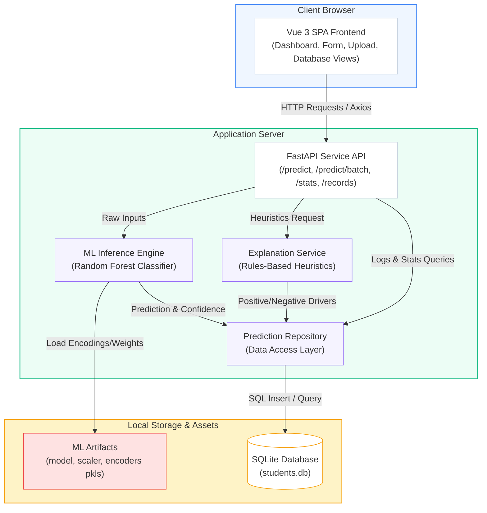
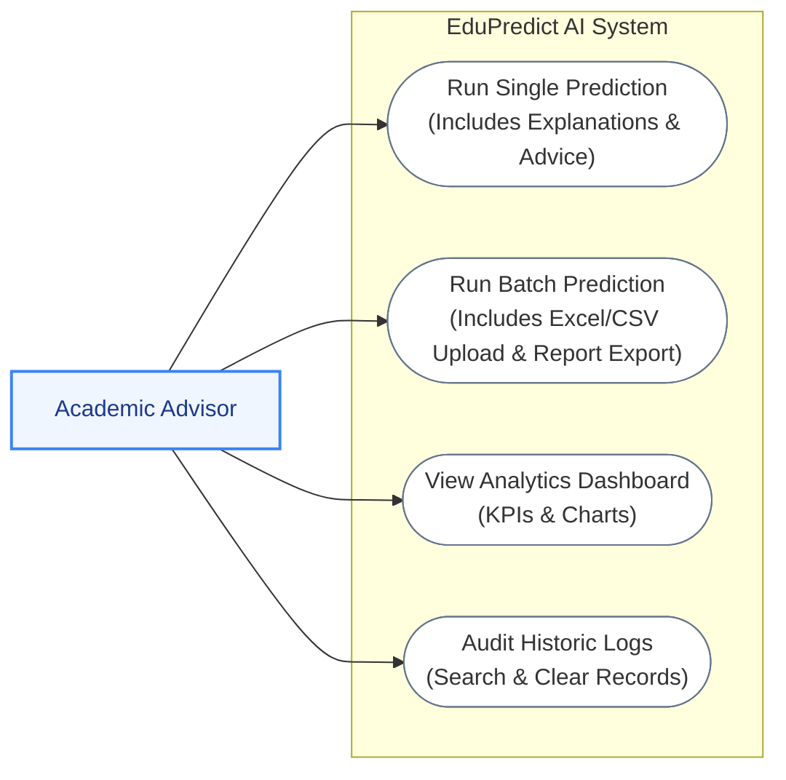
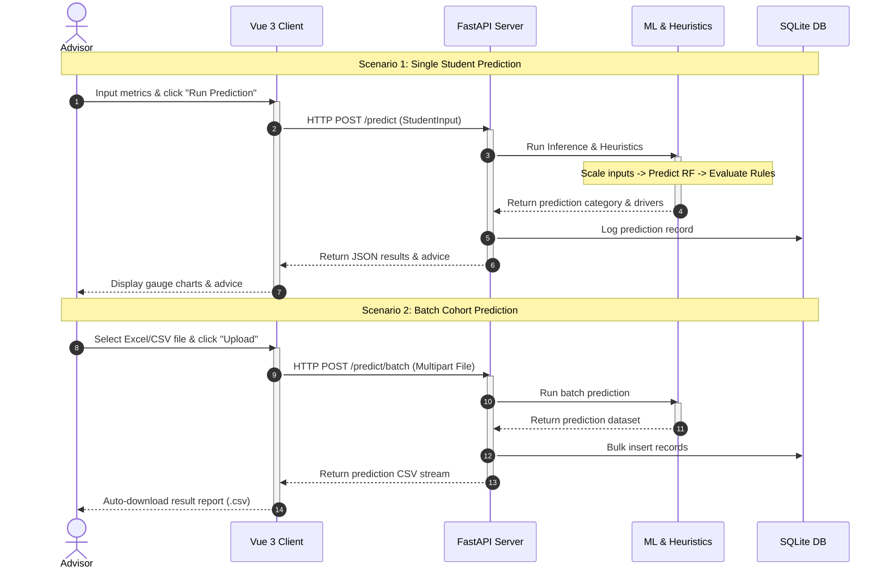
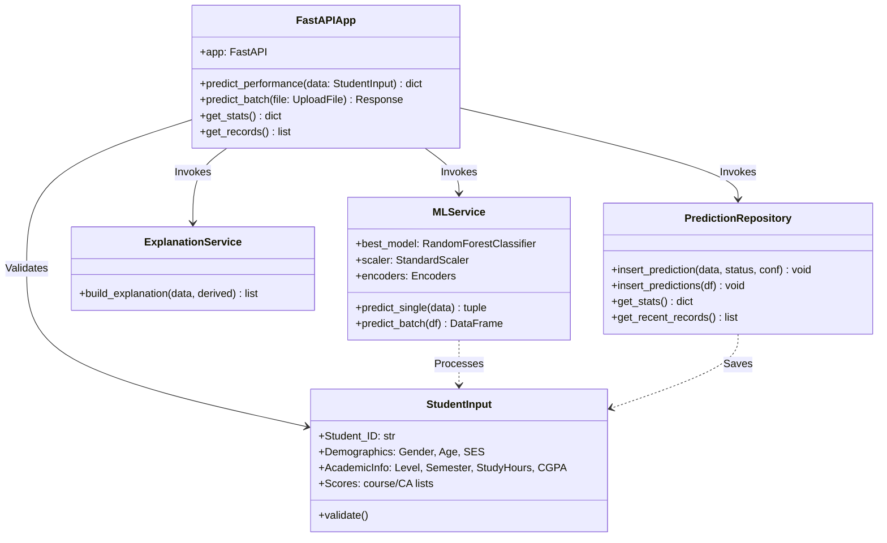

# EduPredict AI Mermaid Diagrams for Draw.io (Simplified & Compact)

This document contains simplified, high-level Mermaid source codes for the four core diagrams of the **EduPredict AI** system. These versions are designed to be much more compact and clear, preventing layout sprawl or overlapping lines in Draw.io.

Import these directly into Draw.io via **+ (Insert) > Advanced > Mermaid**.

---

## 1. System Architecture Diagram

---

## 2. Use Case Diagram

---

## 3. Sequence Diagram (Prediction Process)

---

## 4. Class Diagram (Backend Components)

