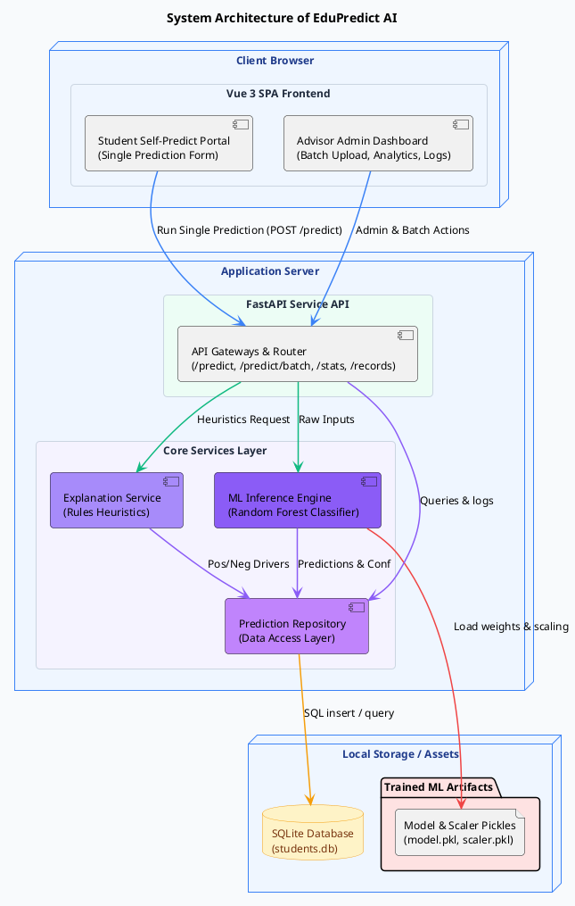
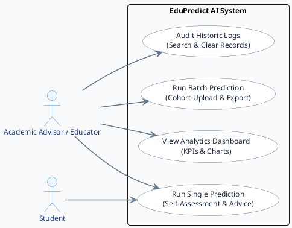
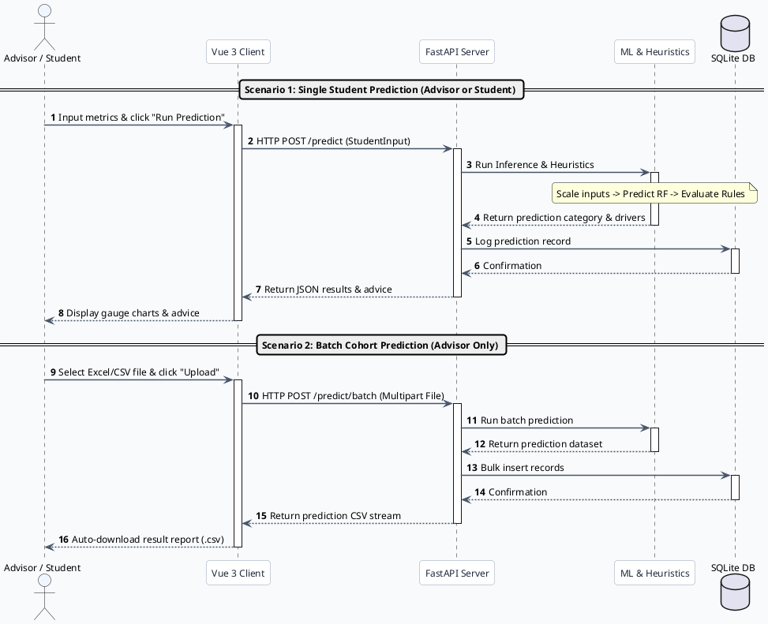
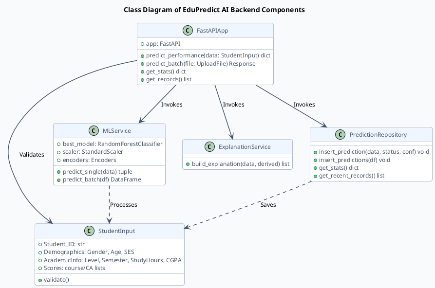

# EduPredict AI PlantText UML Diagrams (Updated with Student Actor)

This document contains simplified, high-level PlantUML/PlantText source codes for the four core diagrams of the **EduPredict AI** system. These versions reflect the addition of the **Student** actor (who can run self-assessment single predictions, while the Advisor retains access to cohort batches, dashboards, and audit logs).

Copy the code for each diagram and paste it directly into [PlantText](https://www.planttext.com).

---

## 1. System Architecture Diagram

---

## 2. Use Case Diagram

---

## 3. Sequence Diagram (Prediction Process)

---

## 4. Class Diagram (Backend Components)

